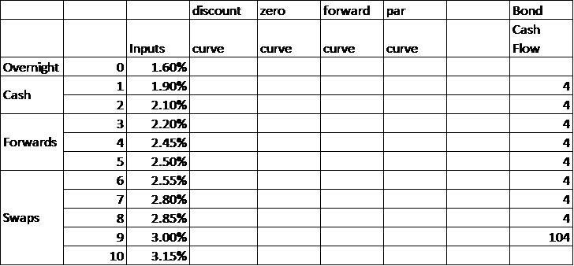
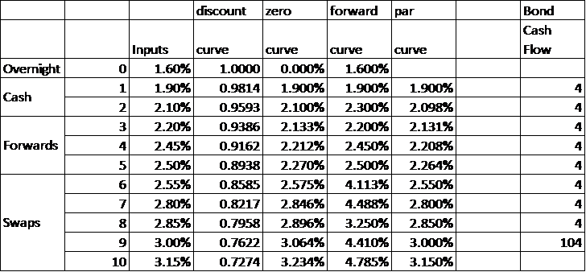
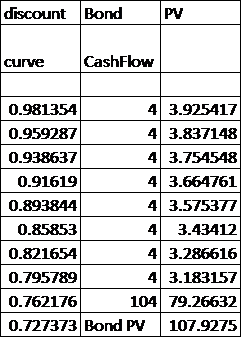
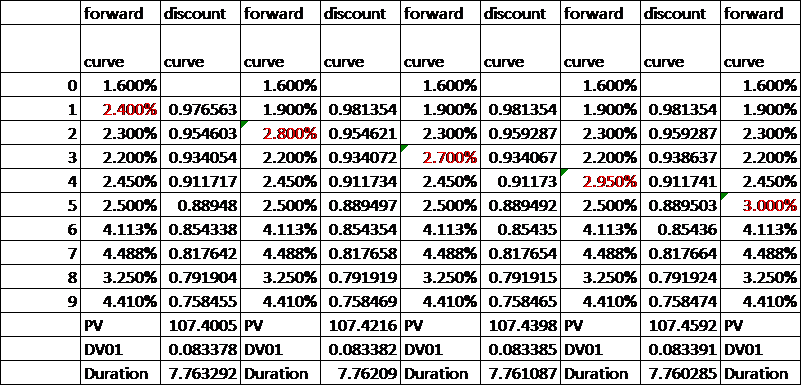
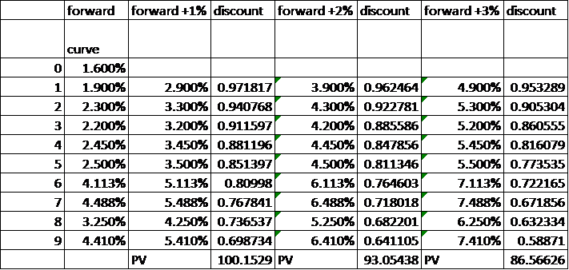
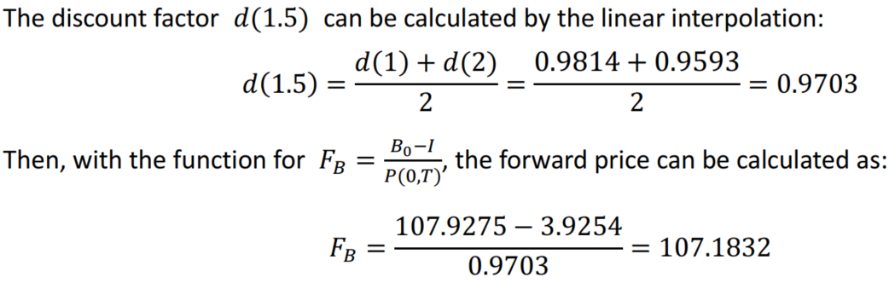
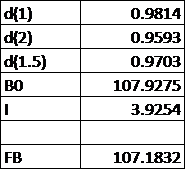
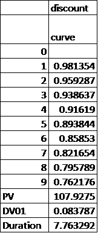

# Compute Bond Valuation and Risk with Discount Curve, Zero Curve, Forward Curve

### author: Yi Rong
### date: 03/21/21
### excel functions: https://drive.google.com/file/d/1UUiJK0MDzYN8HjYyTEdS3DOn6NSOaz8R/view?usp=sharing

---

### Known Data

### a) Fill in discount curve, zero curve, forward curve

### b) Compute the PV of the bond cash flows

PV of the bond cash flows can be calculated with discount curve:

#### c) Change the forward curve by +0.5% (at each maturity one at a time) and compute the discount factors and PV, DV01, duration of the bond for each case. Which forward change has the highest DV01?

The color is red if there is a change. With the formula for duration, the DV01 and Duration can be  obtained as below:

From the result above, the highest DV01 is the last one, which is 0.08344724.

### d) Compute the PV of the bond when increasing simultaneously all the forward rates by 1%, 2%, and 3%

### e) What is the forward price of the bond 18 months from today?

### f) Compute the duration of the bond

